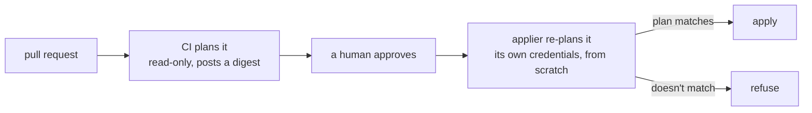

<picture>
  <source media="(prefers-color-scheme: dark)" srcset="docs/assets/truss-horizontal-ondark.svg">
  
</picture>

# Truss

**A GitOps applier where the diff a human approved is provably the diff that
ran**, and where every credential it uses is either hand-made because nothing
could mint it, or minted and rotated by code on a clock.

A truss distributes load and stops a frame racking. This one carries trust:
it re-checks, from scratch and on every pass, that the change in front of it
was reviewed under rules it verifies rather than assumes — then plans the
approved commit with its own credentials and refuses to apply anything whose
plan does not match the one the reviewer read.

**The port is complete; it is not yet deployed.** Truss is a finished
rewrite of a 915-line bash script that runs this in production today. Every
package is built, and the engine is checked three ways: its own tests, and
two independent reviews of the whole codebase — a security review and a
third-party code audit — whose findings are closed.

The strongest of the three is [`internal/parity`](internal/parity), which
replays 37 scenarios recorded from the bash's own test suite against the real
`truss` binary and compares the resulting bucket contents and alert text.
Every difference between the two implementations is an enumerated entry with
a reason, and an entry that stops matching anything fails the build — so an
exemption cannot outlive the divergence it excuses.

What is NOT done is the cutover. Nothing runs truss in the cluster yet: it
reads its credentials from a mounted mirror that the platform does not render
yet, and the plan is to run it in shadow — drift-only, writing to its own
heartbeat key — alongside the bash before anything is switched over. See
[docs/development.md](docs/development.md).

## What is actually different here

Most GitOps setups let a human approve a *preview*, then let a robot compute
a *fresh* plan at apply time and run that instead. Those are two different
plans, and nothing checks that they agree. Between them the world moves — a
token rotates, somebody edits a dashboard, another configuration applies.

**Here they are tied together by a hash.** CI plans once, renders the comment
you read from that same plan file, and files a canonical digest of it. The
applier plans the approved commit again with its own credentials and refuses
to apply any configuration whose plan does not hash to what you approved.

**The direction matters as much as the check.** CI is deliberately read-only,
so what it produces is a witness, not an instruction — a compromised CI can
force a refusal and can never cause an apply. Handing the applier a plan file
to execute instead of a digest to verify would invert exactly that.

There's more worth taking from this design:

- **Every credential is either hand-made or minted by code — nothing sits in
  between.** A hand-made one exists because its issuer has no API to mint it,
  so nothing can rotate it automatically. That's not a reason to let it run
  forever unwatched: it should still carry a real expiry, with enough lead
  time that a human renews it instead of discovering it lapsed. `never` is
  available, and it's the wrong default — a credential that never expires
  also never forces anyone to look at it again. Everything else gets minted
  and rotated on a clock, in two overlapping generations, so swapping one out
  never means restarting whatever's using it.
- **A leak gets answered with a commit, not a scramble in a console.** Name
  the generation in `revoked_generations`, and the next apply destroys every
  token in it and mints nothing to replace them — reviewed, planned, and
  alerted, exactly like any other change would be.
- **The applier checks its own rules every single pass — it never assumes
  yesterday's settings still hold.** Before it touches anything, it reads
  branch protection straight from the forge's API: code-owner review,
  dismiss-stale, enforce-admins, no force-push, a green plan check, branch up
  to date. Miss one and it refuses to run. Turn any of that protection off and
  you haven't weakened the applier. You've stopped it.
- **Drift gets caught without needing an attacker or a bad break — just
  somebody clicking in a console.** Every configuration Truss manages gets
  planned once a day, and nothing gets applied. The pass exists only to check
  whether what's running still matches what's in git. Somebody bumps a
  setting in a dashboard because it's faster than opening a pull request,
  means to write it down later, and doesn't. Nobody notices at first. The
  next engineer who touches that configuration inherits a plan built on a
  fact that's no longer true, and finds out when the apply does something
  unexpected. The daily pass catches the change before any of that happens,
  and says exactly which one drifted.
- **The ledger lives in object storage, not in the cluster**, so a rebuilt
  cluster resumes exactly where the old one stopped.

## Learn more

- [docs/design.md](docs/design.md) — every gate the applier checks before it
  touches anything, and the full path a change takes from pull request to
  applied infrastructure.
- [docs/threat-model.md](docs/threat-model.md) — what each gate stops, and
  what's explicitly out of scope.
- [docs/credentials.md](docs/credentials.md) — how credentials are minted,
  rotated, and revoked.
- [docs/development.md](docs/development.md) — repo layout, how to build it,
  and the guard that keeps this public repo from leaking the private one it
  was ported from.
