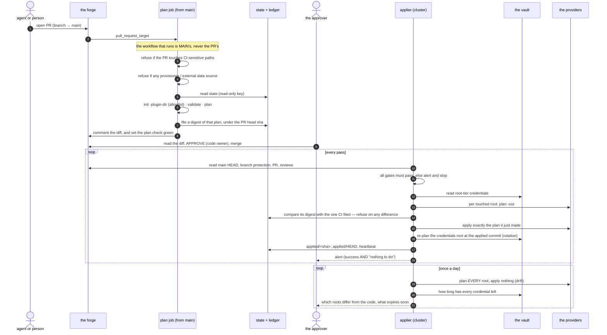
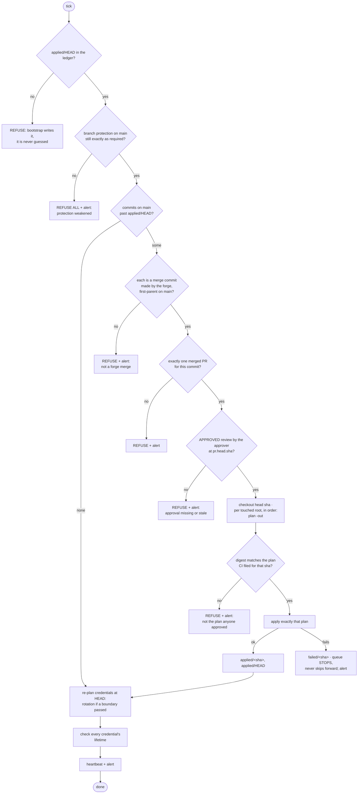

# Truss

**A GitOps applier where the diff a human approved is provably the diff that
ran**, and where every credential it uses is either hand-made because nothing
could mint it, or minted and rotated by code on a clock.

A truss distributes load and stops a frame racking. This one carries trust:
it re-checks, from scratch and on every pass, that the change in front of it
was reviewed under rules it verifies rather than assumes — then plans the
approved commit with its own credentials and refuses to apply anything whose
plan does not match the one the reviewer read.

## Status

⚠️ **Being extracted, not yet extractable.** The running implementation is
915 lines of bash in a private repository, and Truss is its replacement,
ported piece by piece against that reference. Nothing here is deployed.
`internal/gates` is the first real package: every refusal in the system as
pure functions over fetched state, so *"an approval on an earlier push does
not count"* is a function call rather than a whole script driven against stub
binaries.

**This README is the design, and it is ahead of the code.** It describes the
system as the bash version runs it today. Read it as the specification the
port is aimed at, not as a description of what the Go in this repository
does. Where the two differ, the bash version is the truth and this file is
the target.

## What is actually different here

Most GitOps setups let a human approve a *preview*, then let a robot compute
a *fresh* plan at apply time and run that instead. Those are two different
plans, and nothing checks that they agree. Between them the world moves — a
token rotates, somebody edits a dashboard, another root applies.

**Here they are tied together by a hash.** CI plans once, renders the comment
you read from that same plan file, and files a canonical digest of it. The
applier plans the approved commit again with its own credentials and refuses
to apply any root whose plan does not hash to what you approved.

⚠️ **The direction is the point.** CI is deliberately read-only, so the
artifact it produces is a **witness, not an instruction** — a compromised CI
can force a *refusal* and can never cause an apply. Handing the applier a
plan file to execute would invert exactly that.

Five more things worth stealing:

- **Every credential is a root or it is minted. There is no third kind.** A
  root is hand-made because its issuer has no minting API, and carries no
  expiry — a hand-made credential *with* an expiry is the kind that lapses at
  3 a.m. Everything else is minted by code and rotated on a clock in **two
  overlapping generations**, so no consumer is ever restarted at the moment
  of a swap.
- **A leak is answered by a commit.** Name a generation in
  `revoked_generations` and the next apply destroys every token in it and
  mints no replacement — reviewed, planned and alerted like any other change.
- **The applier re-reads the rules it depends on, every pass.** Branch
  protection is not assumed: code-owner review, dismiss-stale, enforce-admins,
  no force-push, a green plan check and *branch up to date* are read from the
  forge's API before anything is touched, and it refuses to run if any is
  missing. Weakening protection does not weaken the applier; it stops it.
- **Drift is caught without an adversary.** Once a day every root is planned
  and nothing is applied. A change made by hand in a dashboard is named in the
  alert — the failure mode that needs no attacker and no bad luck, just
  somebody clicking in a console.
- **The ledger lives in object storage, not in the cluster**, so a rebuilt
  cluster resumes exactly where the old one stopped.

## Terms

- **the approver** — the single human account allowed to approve a change. An
  approval is the only thing that lets a change through, and nothing else in
  the system can give one.
- **a root** — one OpenTofu configuration with its own state file. Planned and
  applied separately; what a root's state holds decides who may read it.
- **the applier** — a small scheduled job inside the cluster. It is the only
  thing in the system holding credentials that can change anything.
- **the forge** — wherever the code and its reviews live. GitHub today, and
  the only implementation.

## What it assumes

Truss is not backend-agnostic and does not pretend to be. Today it assumes:

| Piece | Assumption |
| --- | --- |
| forge | GitHub — Apps, branch protection, PR reviews |
| infrastructure tool | OpenTofu, with a provider allowlist and one pinned version |
| ledger and state | object storage that supports versioning and a create-not-overwrite grant |
| secret store | one vault the applier alone can read, one per project for runtime |
| alerting | one chat transport, on success as well as failure |

Making any of those swappable is a later problem. Naming them is the honest
alternative to a pluggability claim nothing has ever tested.

## The change path

Every change travels the same road: someone opens a pull request, a read-only
job describes what it would do, the approver approves it, and the applier —
not the approver, and not CI — is what actually applies it.



Two things in there are easy to skim past.

**A second loop looks and never touches.** Roots are otherwise derived from a
commit's own diff, so a root that no commit happens to touch is never planned
— and an edit made by hand in a dashboard stays invisible for as long as
nobody changes that root in git. For a system whose premise is that git is the
source of truth, that is the gap that matters. Once a day every root is
planned, nothing is applied, and any root that differs is **named** in the
alert — never counted. *"Two roots drifted"* tells you to go and look, which
is the same as not telling you.

It reports and never reconciles. Quietly undoing a change somebody made
during an incident is its own outage.

**There are two plans, not one, and the applier never runs CI's.** The plan CI
posts is a preview for a human to read; the applier plans the approved commit
again itself and applies the plan it just made. What ties them together is a
hash. The direction is the whole reason it is a digest rather than the plan
file. *Require branch up to date* is what keeps the two plans over the same
configuration in the first place.

⚠️ **A missing digest is a refusal, not a skip.** If no digest was filed for a
commit, the applier refuses that root rather than applying a plan nobody
reviewed. The alternative is a check that passes when its artifact is missing,
which is not a check.

**The applier takes nothing on trust, however recently it was checked.** On
every run it re-reads the branch protection, the merge commit and the approval
from the API and satisfies itself again, rather than remembering that they
were fine last time.

## The gates

Before it changes anything, the applier asks a fixed list of questions about
how the commit in front of it got onto `main`. They run in this order on every
tick, and any one of them failing means **nothing is applied at all** and an
alert explains which one it was.



One of those questions is whether the forge is still configured to require
everything below. The applier reads the settings back from the API and
compares them, rather than assuming they are still as they were set:

| Setting | Value | Why |
| --- | --- | --- |
| Require pull request before merging | on | no direct pushes to `main` |
| Required approving reviews | 1, **from Code Owners** | `CODEOWNERS` names the approver and nobody else, so only that one review counts |
| Dismiss stale approvals on push | on | an approval covers one exact commit, not a branch |
| Required status check | the plan check | no plan, no merge |
| Require branch up to date | on | the plan was computed against exactly what merges |
| Enforce for administrators | on | the approver has admin rights and could otherwise walk past every rule above by accident |
| Allow force pushes / deletions | off | history is the audit log |

⚠️ **Absent is not the same as false**, and treating them alike is how this
went wrong once already. `jq '.allow_force_pushes.enabled // true'` replaces a
COMPLIANT `false` with a non-compliant `true`, because `//` fires on `false`
as readily as on `null`. In `internal/gates` these are pointers, and a missing
key is its own case that never reads as compliant.

⚠️ **A merged PR's `merged` field must come from the detail endpoint.** The
list endpoint returns PR objects with no `merged` field at all — only
`merged_at` — so reading it there is `null` for every PR ever merged. That
gate refused a real first merge.

## What stops each attack

| If someone… | What happens | Enforced by |
| --- | --- | --- |
| opens a PR that edits the plan workflow to exfiltrate its secrets | the workflow that runs is `main`'s; the PR is refused a plan | `pull_request_target` + path refusal |
| adds a malicious provider or a `provisioner "local-exec"` | plan refused | `-plugin-dir` allowlist, grep for provisioner/external |
| gets an agent's forge login | can open PRs. Cannot approve, cannot merge | CODEOWNERS + required code-owner review |
| approves their own PR with any other account | approval ignored | code-owner review required |
| pushes a new commit after the approval | approval dismissed; the applier also checks the sha | dismiss-stale + `pr.head.sha` check |
| turns branch protection off, using the approver's own account | the applier refuses EVERYTHING and alerts | runtime protection check |
| pushes directly to `main` (protection off) | not a forge merge commit → refused | signature/committer check |
| gets the plan job's secrets | reads configuration and state. Changes nothing, reads no token | plan-tier credentials are read-only, and those states hold no secret |
| swaps what would be applied between review and merge — a compromised CI, a resource that moved, a root applied earlier in the same pass | the applier's own plan stops matching the digest CI filed, so the root is refused rather than applied | the plan-digest gate |
| gets root on the box the applier runs on | has everything. **This is the trust root**, stated, not hidden | — |

## Credentials: root or minted, never a third kind

A **root** is made by hand where its issuer has no minting API, carries no
expiry, and lives only in the vault. Everything else is **minted** from a root
with a short life and re-minted by the applier, and written wherever its
consumer reads it. That is why the forge identities are Apps — whose private
keys never expire and which mint hour-long tokens — rather than PATs, which
expire and which no API can renew.

Every item in the vault carries an **`expires`** field: a date, or `never`.
The applier reads them all every run.

### Rotation is the applier's job, not a calendar's

Nobody renews a token on a calendar, and nothing has to remember to. Every
minted token exists as **two overlapping generations** — the current one and
the one before it, both valid — so a new token is always in place well before
the old one dies, and no consumer has to be restarted at the moment of a swap.

The rotation module turns the plan's own timestamp into a generation number:
pure arithmetic, no provider and no clock resource in state, so the same plan
at the same date is byte-identical on any machine and can be evaluated
offline. The credentials root mints `<name>-g<n>` for the current generation
and the one before it, and the vault item always holds the current one. At a
45-day period, every token is at most 90 days old and every consumer has 45
days to pick up the new value on its own refresh.

⚠️ **Why not a clock resource.** `time_rotating` can replace ONE token on a
schedule, and a replaced token is dead the moment the apply runs — while CI
and every pod still holding its predecessor go on using it for hours. The pair
is what removes that window.

Nothing decides "it is time": the applier **re-plans the credentials root at
the end of every run, at the last applied commit**, and the plan is empty
until the date crosses a generation boundary. On that day it mints the next
generation, retires the one two back, repoints the items and rewrites CI's
secrets — and applying it *is* the rotation. It runs whenever the
branch-protection gate passed, even if a commit failed earlier in the pass,
because a failed apply last Tuesday is not a reason for a 45-day window to
close. It never runs at a commit the loop has not applied. A rotation failure
is a failure: recorded in the ledger, non-zero exit, alert.

The credential that applies everything is the one that most needs to rotate,
so it is minted like the rest, and only the token that mints it is made by
hand. That widens nothing: a credential that can mint any credential could
always have minted this one.

What cannot be rotated is what no API can mint. Those the applier **watches**:
anything within 30 days, or with no date recorded at all, is in every
heartbeat and every daily alert until it is renewed. The nag is daily on
purpose — a hand-made credential lapsing takes the applier down with it, and a
warning sent once is a warning sent while somebody was asleep.

### Revocation is a commit, not a dashboard

Rotation is a clock: a token lives two periods however badly its day is going.
That is fine for turnover and useless for *"this leaked this morning"*, and the
answer must not be a person deleting things in a console — that is the hand
operation the whole system exists to remove.

```hcl
revoked_generations = ["g3"]
```

The rotation module drops that generation from the map every resource
iterates, so the next apply destroys its tokens and mints nothing to replace
them. **Absence rather than a flag, deliberately**: a flag would have to be
honoured by each of the resources that iterate, and the one that forgot would
keep minting the burnt key.

⚠️ Revoking the **current** generation is an outage — consumers hold it — so
it fails loudly unless the epoch moves in the same commit. The ordinary
response to a leak is to burn the *previous* generation, which nothing should
still be using.

### The credentials root is the one CI never plans

The applier plans and applies every root the same way. What makes this one
different is that CI never plans it, because CI is not allowed to read its
state — that state *is* the tokens. So the thing under review is the code diff
itself, and for a credential that loses nothing: a token resource's list of
permissions is right there in the HCL, which is the same thing a plan would
have shown. It is exempt from the digest gate for the same reason, and it is
the root the applier re-plans at the end of every run — so a rotation is never
a change nobody approved.

More generally: **what a root's state contains decides who may read it.** The
other roots are forbidden, by a CI-enforced rule, from declaring any credential
resource, so their state is safe for the read-only plan tier. Every token in
the system is declared in the one root whose state is encrypted.

## What this does NOT protect against

- **Root on the machine the applier runs on** reads its vault credential and
  therefore everything. That node is the trust root. It is why it should run
  the applier and nothing else — a machine that can change everything must not
  also be the machine parsing untrusted input off the open internet.
- **The approver's accounts** are the root of everything above. Both the forge
  and the vault login belong behind hardware keys.
- **Secrets set straight on a provider by hand** — a platform's own
  `secret put` command, for instance — are outside this design. Nothing here
  knows they exist, rotates them, or watches them expire.
- **Branch protection may cost money.** On some plans it cannot be enabled on
  a private repository at all, and the applier then refuses everything —
  correct, but check before the first day.
- **A structurally exceeded rate limit is not fixable by backoff.** If a pass
  reads more from the vault than the account is allowed per hour, retrying
  with backoff only spreads the failure out. Budget the reads, then set the
  cadence from the budget.

## Layout

    cmd/applier          the pass: gates, queue, apply, report
    internal/config      every knob, from the environment, validated at start
    internal/forge       the forge: App tokens, branch protection, PRs, reviews
    internal/secrets     the vault: batched reads, rate-limit backoff
    internal/ledger      object storage: applied/, failed/, HEAD, heartbeat
    internal/plan        exec, the canonical digest, verification
    internal/gates       every refusal, as pure functions over fetched state
    internal/notify      alerting

⚠️ **`internal/gates` takes fetched state and returns refusals. It performs no
I/O**, and that is the whole point of the package. In the shell version these
decisions were interleaved with the API calls that fed them, so the only way
to test *"an approval on an earlier push does not count"* was to drive the
entire script against stub binaries and read a ledger object afterwards. Here
it is a function call.

Of that layout, `internal/gates` exists. The rest is the plan.

## Development

    go build ./... && go vet ./... && go test ./...
    scripts/leakscan          # refuses anything identifying a real deployment
    scripts/leakscan-test     # proves leakscan still fails when it should

⚠️ **This repository is written to be public and is ported from a private
one.** That is the whole risk: the reference implementation is a live platform
with real account ids, bucket names, hostnames and vault names in it, and
porting is a copying exercise. `scripts/leakscan` scans for *classes* of thing
rather than a list of real values — a denylist of somebody's actual secrets
would itself be the leak — and CI runs it on every push.

It has its own test because it is a guard, and a guard nobody has watched fail
is a claim rather than a check. Two of its patterns were once written with an
inline `(?i)`, which is not valid ERE: under GNU grep they matched nothing and
the scan passed vacuously.
