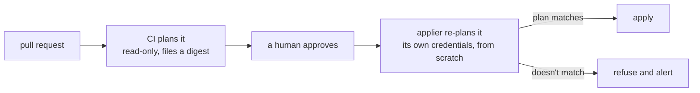

<picture>
  <source media="(prefers-color-scheme: dark)" srcset="docs/assets/truss-horizontal-ondark.svg">
  
</picture>

# Truss

**The infrastructure change a human approved is the one that runs — proven on
every apply, not assumed.** Truss ties an approval to a cryptographic digest of
the exact plan it was given, and refuses to apply anything whose plan does not
hash to what the approver read.

It is a GitOps applier for OpenTofu that runs as a scheduled job inside your
cluster, and it is the only thing in the system holding credentials that can
change anything. Each pass it re-reads your branch protection from the forge's
API, checks how every new commit on `main` actually got there, re-plans that
commit with its own credentials, and applies it only if the plan matches the
approved one. Every credential it touches is either minted and rotated by code
on a clock, or hand-made because no API could mint it — and then watched until
somebody renews it.



## The approved plan is the one that runs

CI plans a pull request once, renders the comment you read from that same plan
file, and files a canonical digest of it. The applier throws CI's plan away and
plans the approved commit again, itself, with its own credentials — then
refuses to apply any configuration whose plan does not hash to the one you
approved.

Between the review and the apply, the world moves. A token rotates, somebody
edits a dashboard, an earlier configuration in the same pass changes something
this one reads. The digest is what notices.

**The direction matters as much as the check.** CI is deliberately read-only,
so what it produces is a witness, not an instruction — a compromised CI can
force a refusal and can never cause an apply. Handing the applier a plan file
to execute, instead of a fingerprint to verify, would invert exactly that.

A missing digest is a refusal, not a skip. A check that passes when its own
evidence is absent is not a check.

## The rules are re-read every pass, never remembered

Before it touches anything, the applier reads your branch protection straight
from the forge's API and satisfies itself again: code-owner review, dismiss
stale approvals on push, enforce for administrators, no force pushes, a green
plan check, branch up to date. Miss one and it refuses to run at all.

Turn any of that protection off and you have not weakened the applier. You have
stopped it.

Then it checks the commit itself, the same way — exactly one merged pull
request produced it, the approver approved it at that precise head sha, and the
merge commit is signed by the forge. An approval given to an earlier push does
not count.

## Secrets are scoped per project, and the applier only reads

The applier has one vault, and it is the only thing that can read it. Every
project gets its own vault for what it runs. A project's runtime credentials
cannot reach the applier's, and one project's cannot reach another's — a leaked
runtime secret costs you the project it belongs to, not the platform.

The applier's own access is narrower than it looks. It reads its credentials
from a mounted mirror rather than dialling the vault at all, and its vault role
can list an item and read one metadata field — when that item expires — and
nothing else. It cannot read a secret's value and it cannot write one. Every
credential in the system is created by the single OpenTofu configuration that
declares them, which the applier applies under review, like any other change.

## Credentials rotate on a clock, or get watched until a human renews them

A credential is a **root** when nobody can mint it: no API for it exists, so
it is made by hand. Everything else is **minted** — born from a root with a
short life, re-minted on schedule, written wherever the thing using it reads
it.

Minted credentials exist as **two overlapping generations**, the current one
and the one before, both valid. A replacement is always in place well before
its predecessor dies, so nothing has to be restarted at the moment of a swap.
At a 45-day period every token is at most 90 days old, and every consumer has
45 days to pick up the new value on its own refresh.

Nothing decides that it is time. The applier re-plans the credentials
configuration at the end of every pass, and that plan is empty until the date
crosses a generation boundary. On the day it does, applying it *is* the
rotation.

What no API can mint, the applier **watches** instead. Every item carries a real
expiry date, every pass reads all of them, and anything inside the warning
window — or carrying no date at all — is named in the heartbeat and in the
alert, every day, until it is renewed. `never` is available and it is the wrong
default: a credential that never expires is a credential nobody ever looks at
again.

## A leak is answered with a commit, not a console

```hcl
revoked_generations = ["g3"]
```

The next apply destroys every token in that generation and mints nothing to
replace them — reviewed, planned, digest-checked and alerted, exactly like any
other change. It is an absence rather than a flag, deliberately: a flag has to
be honoured by every resource that iterates the map, and the one that forgot
would keep minting the burnt key.

Revoking the *previous* generation is the ordinary answer to a leak, because
nothing should still be holding it. Revoking the *current* one on its own is an
outage, so it is refused; what a leaked current generation needs is the next
generation minted early, which is the same commit moving the epoch.

## Drift is caught by looking, not by waiting for a break

A configuration only gets planned when some commit touches it, so one nobody
has edited in months could drift all that time with nothing ever checking. Once
a day every configuration Truss manages is planned, nothing is applied, and any
that differs from git is **named** — not counted. "Two configurations drifted"
is homework, not an alert.

Somebody bumps a setting in a dashboard because it is faster than opening a
pull request, means to write it down later, and doesn't. The next person to
touch that configuration inherits a plan built on a fact that is no longer
true, and finds out when the apply does something nobody expected. The daily
pass catches it first.

It reports and reconciles nothing, on purpose. Quietly undoing a change
somebody made mid-incident would be its own outage.

## A rebuilt cluster resumes at the commit the old one stopped at

The ledger lives in object storage, not in the cluster: a record per applied
commit, a record per failure, the current HEAD, and a heartbeat. Lose the
cluster entirely, rebuild it, and the applier reads HEAD and carries on at
exactly the commit its predecessor finished — nothing replayed, nothing
skipped.

An absent ledger is a refusal, not a fresh start. The applier will not guess
where to resume, because every guess is either re-applying commits or silently
passing over them. Bootstrap writes that first entry once, deliberately, and
nothing else ever writes it.

Stopping the queue is not the same as going quiet. Whether a commit is refused,
fails to apply, or applies cleanly, the pass reaches the same tail: the expiry
sweep runs, the heartbeat is written, and the alert goes out — on success as
well as failure, because a job that reports only when it fails cannot be told
apart from a job that is no longer running.

## Nothing about your deployment is baked into the binary

The repository, the approver, the bucket and its prefixes, the vault mount, and
the forge and cloud API endpoints are all read from the environment and
validated before the first pass. A missing one refuses to start rather than
falling back to something plausible. Pointing Truss at a different cluster, a
different bucket or a different repository is configuration, not a fork.

## What this does not prove

- **That the review was any good.** The digest proves the plan you approved is
  the plan that ran. A rubber-stamped approval is still an approval.
- **Anything, against root on the applier's own node.** That machine reads the
  vault credential and therefore everything. It is the trust root — stated,
  not hidden — and it is why it should run the applier and nothing else.
- **Anything about secrets set by hand.** A credential typed straight into a
  provider's console is outside all of this. Nothing here knows it exists,
  rotates it, or watches it expire.
- **That there is a way past a stuck gate.** There is no break-glass. A gate
  refusing for a reason that turns out to be wrong is fixed by fixing the
  condition it is checking. That is a known gap, not a settled design.

## Learn more

- [docs/design.md](docs/design.md) — every gate the applier checks before it
  touches anything, and the full path a change takes from pull request to
  applied infrastructure.
- [docs/threat-model.md](docs/threat-model.md) — what each gate stops, and
  what is explicitly out of scope.
- [docs/credentials.md](docs/credentials.md) — how credentials are minted,
  rotated, and revoked.
- [docs/development.md](docs/development.md) — repo layout, how to build it,
  and how to run the tests.
